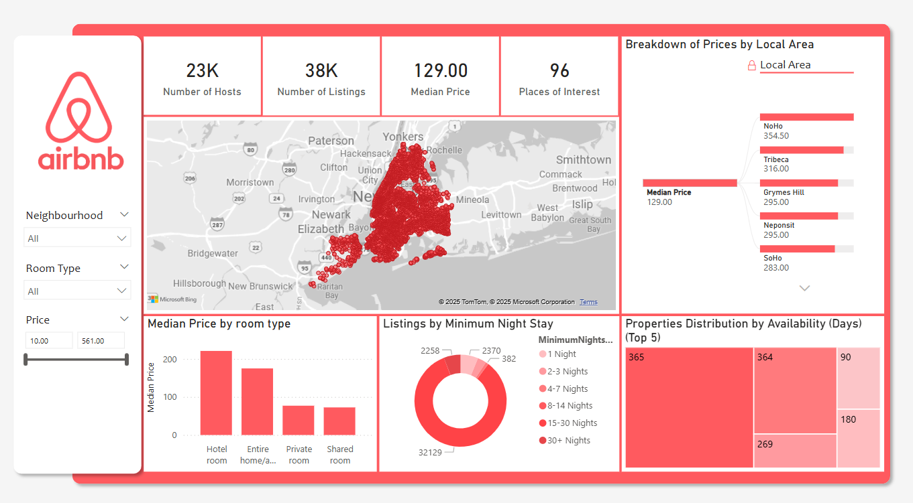
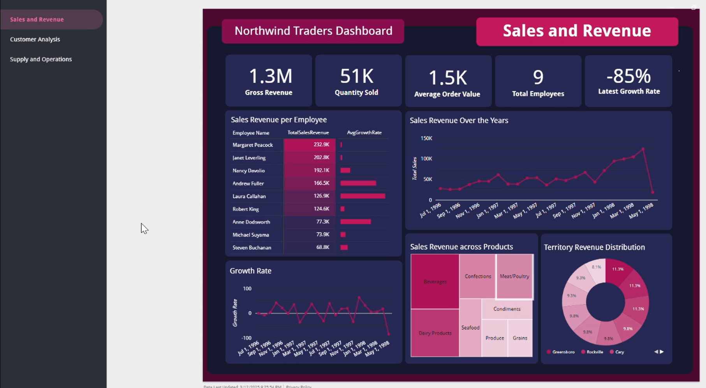

## Welcome! 
I'm Ayush, a recent graduate in Data Science from the London School of Economics (LSE). This space highlights my journey through data science, showcasing key projects where I've applied my passion for turning complex data into actionable insights. My recent work with the Westminster City Council was awarded the Winton Prize for Best Capstone Project at LSE [(News)](https://www.winton.com/news/winton-prizes-for-excellence-in-statistics-2025). 

Feel free to explore my work below, and don't hesitate to reach out if you're interested in collaborating or learning more!

**Contact Me:**  
Email: [ayushstephen2002@gmail.com](mailto:ayushstephen2002@gmail.com)  
Linkedin: [LinkedIn-Ayush Stephen Toppo](https://www.linkedin.com/in/ayush-stephen-toppo-aa29b8201)

**Technical Skills:**  
Python, R, C++, SQL, PowerBI, Tableau, Looker Studio, Google Cloud Computing, Advanced Excel. 

## My Projects

### An Analysis of Airbnb Prices in New York City

[Project1](https://github.com/StephenACodes/myportfolio.github.io/tree/main/Project1)

This project analyzed factors influencing Airbnb prices in New York City using statistical analysis methods and data visualization. It included property segmentation based on characteristics like location and amenities, and audience analysis to assess market demand and pricing trends across neighborhoods. The insights aid stakeholders in developing data-driven pricing strategies for selecting the best places. A Power BI dashboard was created to visualize the findings, incorporating DAX queries for dynamic calculations and Power Query for data transformation, enabling interactive analysis of pricing trends and market dynamics across different neighborhoods.

### Northwind Traders SQL Analysis

[Project2](https://github.com/rheamall/Northwind-Traders-SQL-Analysis)

This project is comprehensive SQL analysis of the Northwind Traders database, exploring data insights through complex queries, joins and CTEs. This project involved analyzing sales revenue, customer behavior, suppliers, operational efficiency and logistics to derive actionable insights for business improvement.

### Comparing Machine Learning Methods for Predicting Income Increase 

[Project3](https://github.com/StephenACodes/myportfolio.github.io/tree/main/Project2)

This project investigated median income increases across New York counties from 2014 to 2019. We used socio-demographic data on the US census tract level to predict whether a given census tract experienced positive economic growth, measured by the median income. We collected data from the US Census Bureau for the economic and social indicators on the Census Tract Level made available from the American Community Survey 5-Year Data (ACS5). To measure the economic change, we retrieved the median income for both 2014 and 2019 and computed the percentage change over the time period. In addition, we created a new variable to classify a census tract based on the direction of change in median income. Using socio-economic factors like education and unemployment rate, among many others, as predictors, we utilized Machine Learning models from linear regression to Neural Networks to identify significant predictors of income growth and to provide insights into factors driving economic development in different regions.

### Predicting Yelp Review Popularity 

[Project4](https://github.com/StephenACodes/myportfolio.github.io/tree/main/Project3)

The insights generated from this project were tailored to enhance Yelp’s review management system to support a more engaging customer experience. The project aimed to predict which reviews are most likely to be useful and popular. Leveraging Big Data frameworks and natural language processing techniques, it analyzed key factors influencing review utility, enabling the development of machine learning models that accurately forecast review popularity.  

### Developing Methods for the Coordinate Descent Algorithm

[Project5](https://github.com/StephenACodes/myportfolio.github.io/tree/main/Project4)

This project involved developing coordinate descent algorithms to solve lasso and elastic net regression problems, with a focus on optimizing predictive accuracy and variable selection. K-fold cross-validation was applied to fine-tune models using mean-squared error (MSE) values for optimization. Performance was analyzed across scenarios where the number of data points (n) exceeds the number of variables (p), and where variables (p) exceed data points (n). The results demonstrated that elastic net outperforms lasso, particularly in complex scenarios with highly correlated variables and limited data availability.

